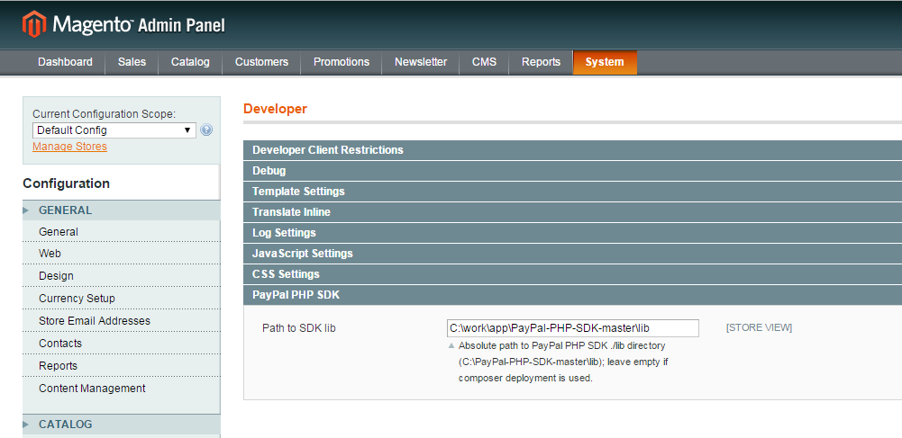

# PayPal PHP SDK for Magento
Magento extension that adopts [PayPal PHP SDK](https://github.com/paypal/PayPal-PHP-SDK) classes to be used in Magento classes.

## Installation

### Composer

Add to your `composer.json`:

    {
      "repositories": [
        {
          "type": "vcs",
          "url": "https://github.com/flancer32/mage_ext_api_pp_sdk"
        }
      ],
      "require": {
        "flancer32/mage_ext_api_pp_sdk": "dev-master"
      }
    }

### External library

Download [PayPal PHP SDK](https://github.com/paypal/PayPal-PHP-SDK/releases) and extract archive to the local drive.
Setup path to ```./lib/``` folder in _System / Configuration / Advanced / Developer / PayPal PHP SDK / Path to SDK_:



## Usage

    // Just call helper's initClassLoader() method ... 
    Mage::helper('flancer32_ppapi_helper')->initClassLoader();
    // ... and use PayPal PHP SDK classes in your own code
    $apiContext = new PayPal\Rest\ApiContext(
        new PayPal\Auth\OAuthTokenCredential(
            'clientId',
            'clientSecret'
        )
    );
    ...