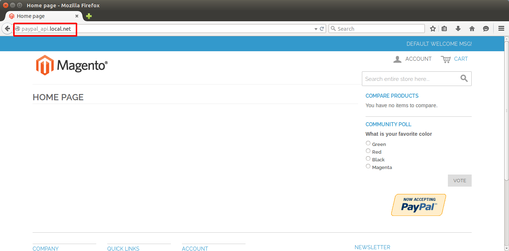

# Development and Testing

Development and testing environment is deployed into this location.

## Development Environment Installation

### Create Magento Database

Launch MySQL console client and execute following statements:

    $ mysql -u root -p
    Enter password: 
    ...
    mysql> drop database if exists mage_api_pp;
    mysql> create database mage_api_pp character set utf8 collate utf8_unicode_ci;
    mysql> create user 'mage_api_pp'@'%' identified by '...';
    mysql> grant all privileges on mage_api_pp.* to 'mage_api_pp'@'%';
    mysql> quit;

### Setup DNS

Edit local DNS file (`/etc/hosts` on Linux or `C:\Windows\System32\drivers\etc` on Windows):

    127.0.0.1	paypal_api.local.net

... or setup global DNS for your domain (you should know how to do it, if you don't know - setup local DNS).

### Setup Web Server

#### Apache

    <VirtualHost *:80>
        ServerName paypal_api.local.net
        DocumentRoot /path/to/mage_ext_api_pp_sdk/test/mage
        <Directory /path/to/mage_ext_api_pp_sdk/test/mage/>
            Options Indexes FollowSymLinks
            Order allow,deny
            Allow from all
            AllowOverride All
            Require all granted
        </Directory>
        LogLevel info
        ErrorLog  /var/log/apache2/pp_api_error.log
        CustomLog /var/log/apache2/pp_api_access.log combined
    </VirtualHost>

### Configure Installation Script

Copy `install.sh.init` to `install.sh` (or `install.cmd.init` to `install.cmd` on Windows) and replace configuration 
parameters by own values:

    php mage/install.php \
    --license_agreement_accepted "yes" \
    --locale "en_US" \
    --timezone "Europe/Riga" \
    --default_currency "USD" \
    --db_host "localhost" \
    --db_name "mage_api_pp" \
    --db_user "mage_api_pp" \
    --db_pass "..." \
    --url "http://paypal_api.local.net/" \
    --use_rewrites "no" \
    --use_secure "no" \
    --secure_base_url "http://paypal_api.local.net/" \
    --use_secure_admin "no" \
    --admin_lastname "Admin" \
    --admin_firstname "Test" \
    --admin_email "admin@email.com" \
    --admin_username "admin" \
    --admin_password "..."

### Install Magento App

On Linux:

    $ git clone git@github.com:flancer32/mage_ext_api_pp_sdk.git
    $ cd ./mage_ext_api_pp_sdk/test/
    $ composer install
    $ ./vendor/bin/composerCommandIntegrator.php magento-module-deploy
    $ ./install.sh
    SUCCESS: 7c52f22cf68ef1ae1476ca4b1bb74073

On Windows:

    > cd .\test\
    > composer install
    > vendor\bin\composerCommandIntegrator.php.bat magento-module-deploy
    > install.cmd
    SUCCESS: 7c52f22cf68ef1ae1476ca4b1bb74073

Value *7c52f22cf68ef1ae1476ca4b1bb74073* is the `/config/global/crypt/key` node from `test/mage/app/etc/local.xml`.

## Verify Installation

Open URL [http://paypal_api.local.net/](http://paypal_api.local.net/) in your browser, you should get smth. like:

Open [http://paypal_api.local.net/index.php/admin/](http://paypal_api.local.net/index.php/admin/) to get administrative
access to Magento.